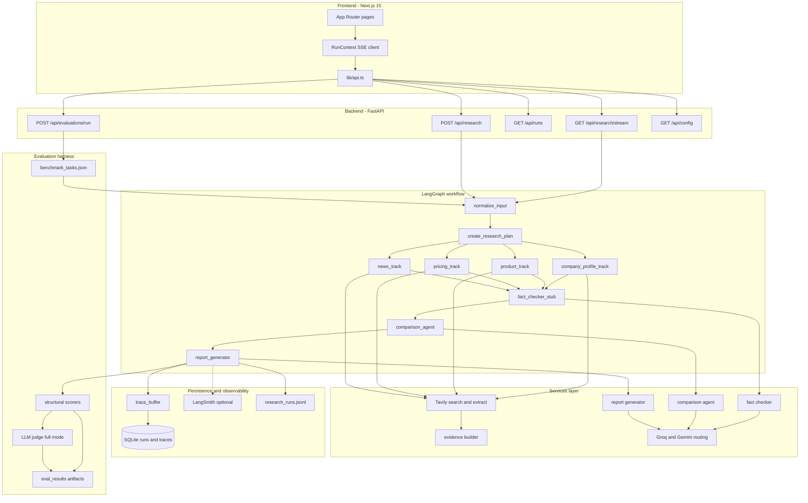

# RivalScope AI

**Source-grounded competitive intelligence for GTM teams** — a full-stack AI engineering portfolio project that researches public web sources, verifies claims, builds head-to-head comparisons, and synthesizes cited battlecards. Every pipeline step is observable: live SSE streaming, tool-use traces, optional LangSmith export, and a benchmark evaluation harness.

---

## At a glance

| | |
| --- | --- |
| **Problem** | Sales and strategy teams need competitor briefs backed by citations — not generic LLM prose. |
| **Approach** | Fixed LangGraph DAG with parallel research tracks, deterministic scorers, and LLM-as-judge grounding evals. |
| **Stack** | Next.js 15 · FastAPI · LangGraph · LangChain · Tavily · Groq · Gemini |
| **Benchmark** | 22 curated competitor-pair tasks across 3 report types |
| **Tests** | 129 backend pytest cases (mock mode, no API keys) |
| **Demo** | Mock mode works offline; real mode uses live Tavily + LLM APIs |

**Recruiter demo path (5 min):** `/overview` → `/` start a run → `/workflow` watch the animated graph + tool traces → `/report` → `/evidence` → `/evaluations`.

---

## Architecture



### Design principles

- **Orchestrated pipeline, not autonomous agents** — nine fixed LangGraph nodes; no dynamic tool-calling planner.
- **Symmetric research** — both companies searched across four parallel tracks (company, product, pricing, news).
- **Source-first outputs** — `Source` + `EvidenceItem` models; citations required in comparison matrix and report.
- **Application-enforced grounding** — source-ID allowlists, claim-status filters, comparison business rules, post-report grounding, and deterministic confidence (see [`docs/ai-pipeline-contract.md`](docs/ai-pipeline-contract.md)).
- **Observable by default** — in-app trace buffer + SSE; LangSmith is an optional hosted layer.
- **Eval-driven quality** — structural metrics run free offline; full mode adds LLM-judge grounding.

---

## Tech stack

| Layer | Technologies |
| --- | --- |
| **Frontend** | Next.js 15 (App Router), React 19, TypeScript, Tailwind CSS 4 |
| **API** | FastAPI, Pydantic v2, SSE (`StreamingResponse`) |
| **Orchestration** | LangGraph (`StateGraph`, parallel fan-out/fan-in, `astream_events v2`) |
| **LLM adapters** | LangChain (`ChatGroq`, `ChatGoogleGenerativeAI`) |
| **Search** | Tavily Search + Extract (`langchain-tavily`) |
| **Persistence** | SQLite (`research_runs`, `run_traces`, `evaluations`) |
| **Observability** | Custom `trace_buffer`, LangSmith `@traceable`, `research_runs.jsonl` |
| **Testing** | pytest, pytest-asyncio, FastAPI TestClient |

---

## LangGraph pipeline

Nine steps — four research tracks run in parallel after planning:

```text
START
  → normalize_input
  → create_research_plan
  → ┬ company_profile_track ─┐
    ├ product_track           ─┤  (parallel)
    ├ pricing_track           ─┤
    └ news_track              ─┘
  → fact_checker_stub
  → comparison_agent
  → report_generator
  → END
```

| Node | Role | Real-mode tools |
| --- | --- | --- |
| `normalize_input` | Validate request, seed state | — |
| `create_research_plan` | Fan out four research tracks | — |
| `company_profile_track` | Homepage, about, profile queries | `tavily_search`, `tavily_extract` |
| `product_track` | Features, use cases, docs | `tavily_search`, `tavily_extract` |
| `pricing_track` | Plans, pricing pages | `tavily_search`, `tavily_extract` |
| `news_track` | Launches, funding, partnerships | `tavily_search`, `tavily_extract` |
| `fact_checker_stub` | Verify evidence claims vs sources | `fact_checker_llm` |
| `comparison_agent` | Two-sided comparison matrix | `comparison_agent_llm` |
| `report_generator` | Structured `CompetitorReport` JSON | `report_generator_llm` |

**LLM routing:** Groq primary (`llama-3.1-8b-instant`); Gemini fallback (`gemini-2.5-flash`) on failure or oversized prompts (`GROQ_MAX_PAYLOAD_CHARS`).

**Modes:** `RESEARCH_MODE=mock` (deterministic, no keys) · `RESEARCH_MODE=real` (live Tavily + LLM).

---

## Frontend

Warm paper-like design system with live workflow visualization.

| Route | Purpose |
| --- | --- |
| `/overview` | Portfolio landing — pipeline story + architecture summary |
| `/` | New research run form |
| `/workflow` | **Live agent workflow** — animated LangGraph, SSE progress, streaming tool log |
| `/report` | Competitive report summary |
| `/evidence` | Evidence review & source inspector |
| `/battlecard` | Sales battlecard (talk tracks, objections, landmines) |
| `/runs` | Run history + persisted traces |
| `/evaluations` | Evaluation dashboard + trigger benchmark runs |
| `/settings` | Provider config, tracing status (non-secret) |

### Key frontend modules

| Path | Responsibility |
| --- | --- |
| `lib/runContext.tsx` | SSE `EventSource` client — `agent_status`, `token`, `trace`, `final_report` |
| `lib/api.ts` | REST client, report deserialization, stream URL builder |
| `lib/steps.ts` | Nine graph node display metadata |
| `lib/reportStore.ts` | Session persistence (report + traces) |
| `components/WorkflowGraph.tsx` | Animated pipeline graph (glow, flow arrows, parallel track cluster) |
| `components/TopNav.tsx` | App navigation |
| `components/ui/primitives.tsx` | Shared design system (Card, Badge, StatCard, etc.) |

---

## Backend modules

| Module | Path | Responsibility |
| --- | --- | --- |
| **API routes** | `app/api/routes/` | `research`, `runs`, `evaluations`, `config` |
| **Graph** | `app/graph/` | `workflow.py`, `nodes.py`, `state.py`, `constants.py` |
| **Services** | `app/services/` | `search`, `research_tracks`, `evidence`, `fact_checker`, `comparison_agent`, `report_generator`, `llm`, `query_builder`, `context_budget` |
| **Schemas** | `app/schemas/` | `CompetitorReport`, `ResearchRequest`, `ProgressEvent` |
| **Evaluation** | `app/evaluation/` | Benchmark loader, runner, scorers, judge, report writer, failure analysis |
| **Observability** | `app/observability/` | `trace_buffer`, `metrics`, `tracing` (LangSmith decorator) |
| **Database** | `app/db/` | SQLite repository for runs, traces, evaluations |
| **Config** | `app/core/config.py` | Pydantic settings from `backend/.env` |

### API surface

| Method | Path | Description |
| --- | --- | --- |
| `GET` | `/health` | Health check |
| `GET` | `/api/config` | Non-secret runtime config (providers, tracing, research mode) |
| `POST` | `/api/research` | Synchronous full workflow → `{ report }` |
| `GET` | `/api/research/stream` | Live SSE research stream |
| `GET` | `/api/runs` | List persisted runs |
| `GET` | `/api/runs/{id}` | Run detail + report JSON |
| `GET` | `/api/runs/{id}/traces` | Tool/LLM traces for a run |
| `GET` | `/api/evaluations` | List evaluation experiments |
| `POST` | `/api/evaluations/run` | Run benchmark subset |

#### SSE event types (`/api/research/stream`)

| Event | Payload | When |
| --- | --- | --- |
| `agent_status` | `{ runId, step, name, status, message? }` | Node start / end |
| `token` | `{ step, node, delta }` | Best-effort LLM streaming |
| `trace` | Tool/LLM span from `trace_buffer` | After each Tavily or LLM call |
| `final_report` | Complete `CompetitorReport` | Graph success |
| `error` | `{ detail }` | Failure or missing keys |

---

## Evaluation framework

A unified benchmark harness in `backend/app/evaluation/` measures **structural report quality**, **comparison matrix integrity**, and (in full mode) **claim grounding** against source text.

### Benchmark dataset

| Property | Value |
| --- | --- |
| **File** | `backend/app/evaluation/benchmark_tasks.json` |
| **Tasks** | **22** competitor-pair scenarios |
| **Report types** | `quick_brief`, `deep_research`, `sales_battlecard` |
| **Expected sections** | 9 per task (`company_snapshot`, `product_positioning`, `feature_comparison`, `pricing_intelligence`, `recent_moves`, `strengths`, `weaknesses`, `sales_battlecard`, `sources`) |
| **Expected source types** | `company_page`, `pricing_page`, `news`, `docs`, `other` |
| **Expected facts** | Curated reference claims per task (dataset field — **not yet scored**, reserved for future fact-recall metric) |

### Eval modes

| Mode | CLI | API keys | What runs |
| --- | --- | --- | --- |
| **Structural** | `--mode structural` | None (mock research) | Deterministic scorers only |
| **Full** | `--mode full` | Gemini for judge (+ real keys if `RESEARCH_MODE=real`) | Structural + LLM-as-judge grounding |

```bash
cd backend

# Offline baseline — free, no keys
python scripts/run_evaluation.py --mode structural --max-tasks 5 --experiment mock_baseline

# Grounding eval — adds LLM judge per evidence claim
python scripts/run_evaluation.py --mode full --max-tasks 3 --experiment full_smoke

# Live research + judge (consumes Tavily + Groq credits)
python scripts/run_evaluation.py --mode full --max-tasks 5 --experiment live_v1
```

**Outputs** (gitignored): `backend/eval_results/{experiment}.json`, `.csv`, `{experiment}_summary.md`, `{experiment}_failure_modes.md`.

Each experiment records `langsmith_tracing` and `langsmith_project` when LangSmith is enabled.

---

## Evaluation metrics (complete reference)

### Overall score (structural)

Weighted composite used as the primary quality signal:

| Metric | Weight | Definition |
| --- | ---: | --- |
| **Task completion** | 30% | Fraction of 8 major report fields populated (`company_snapshot`, `product_positioning`, `feature_comparison`, `pricing_intelligence`, `strengths`, `weaknesses`, `sales_battlecard`, `sources`) |
| **Section coverage** | 25% | Fraction of task-specific `expected_sections` present and non-empty |
| **Source coverage** | 20% | Fraction of task-specific `expected_source_types` found among report sources |
| **Citation integrity** | 15% | Average of (a) evidence `source_id` resolves to a real source, (b) sources have valid URLs |
| **Efficiency** | 10% | Latency bucket score (see below) |

**Formula:** `overall_score = 0.30×task_completion + 0.25×section_coverage + 0.20×source_coverage + 0.15×citation_integrity + 0.10×efficiency`

### Efficiency (latency buckets)

| Latency | Efficiency score | Label |
| --- | ---: | --- |
| ≤ 30s | 1.0 | excellent |
| 31–60s | 0.7 | acceptable |
| 61–120s | 0.4 | slow |
| > 120s | 0.1 | very slow |

### Comparison metrics (all modes — deterministic)

| Metric | Type | Definition |
| --- | --- | --- |
| **comparison_two_sidedness** | Rate 0–1 | % of comparison matrix rows where **both** `our_value` and `competitor_value` are filled and not "not found in available sources" |
| **comparison_citation_validity** | Rate 0–1 | % of matrix rows where all cited `our_source_ids` + `competitor_source_ids` resolve to real `report.sources` |
| **advantage_distribution** | Count map | Tally of `advantage` flags per row (`our`, `competitor`, `parity`, etc.) |
| **Advantage honesty flag** | Failure note | Informational warning if 100% of rows favor one side (suspicious bias) |

### Grounding metrics (`--mode full` only — LLM judge)

Judge model defaults to **`gemini-2.5-pro`** (stronger tier than synthesis `gemini-2.5-flash` to reduce self-eval bias). Each evidence claim is judged against its cited source text only.

**Judge verdict taxonomy:**

| Verdict | Meaning |
| --- | --- |
| `supported` | Claim fully entailed by source text |
| `partial` | Source partly supports claim |
| `unsupported` | Source silent on claim |
| `contradicted` | Source states the opposite |
| `citation_invalid` | Broken or missing source reference |

| Metric | Type | Definition |
| --- | --- | --- |
| **grounding_rate** | Rate 0–1 | `supported` verdicts ÷ total judged evidence claims |
| **hallucination_rate** | Rate 0–1 | `contradicted` verdicts ÷ total judged evidence claims |
| **comparison_grounding** | Rate 0–1 | % of judged matrix cell values (`our_value` / `competitor_value`) rated `supported` or `partial` against cited source snippets |
| **judge citation_validity** | Internal | `(total − citation_invalid) ÷ total` during judge aggregation (feeds failure notes, not a separate CSV column) |

Contradicted claims are appended to per-task `failure_notes` for failure-mode analysis.

### Per-task operational metrics (recorded, not weighted)

| Metric | Description |
| --- | --- |
| `evidence_count` | Evidence items in final report |
| `source_count` | Unique sources collected |
| `latency_seconds` | End-to-end task duration |
| `warnings_count` | Pipeline warnings + report warnings |
| `failure_notes` | Human-readable issue list (sections missing, one-sided rows, contradicted claims, etc.) |

### Experiment-level aggregates

| Field | Description |
| --- | --- |
| `average_score` | Mean `overall_score` across tasks |
| `average_latency_seconds` | Mean latency |
| `average_source_count` | Mean sources per task |
| `avg_comparison_two_sidedness` | Mean two-sidedness |
| `avg_comparison_citation_validity` | Mean matrix citation validity |
| `avg_grounding_rate` | Mean grounding (full mode) |
| `avg_hallucination_rate` | Mean hallucination (full mode) |
| `avg_comparison_grounding` | Mean matrix grounding (full mode) |

Failure analysis (`failure_analysis.py`) groups recurring issues into markdown reports: low overall scores, weak dimensions, comparison matrix problems, latency outliers, and contradicted claims.

---

## Observability

### In-app (always on)

| Surface | What you see |
| --- | --- |
| `/workflow` | Live SSE `trace` events + animated graph |
| `/runs` → Traces | Persisted spans from SQLite |
| `/settings` | Provider status, LangSmith on/off |

Trace kinds: `tavily_search`, `tavily_extract`, `fact_checker_llm`, `comparison_agent_llm`, `report_generator_llm`.

### LangSmith (optional)

```bash
# backend/.env
LANGSMITH_TRACING=true
LANGSMITH_API_KEY=lsv2_...
LANGSMITH_PROJECT=rivalscope-ai
```

Restart backend after changes. View traces at [smith.langchain.com](https://smith.langchain.com).

**Trace hierarchy:** `research_graph` → graph nodes → Tavily tools (`@traceable`) → LangChain LLM spans. Eval runs add `evaluation_experiment` → `benchmark_task` → `judge_claim`.

Run metrics also append to `backend/app/logs/research_runs.jsonl` (gitignored).

---

## Quick start

### Prerequisites

- Node.js 18+
- Python 3.11+
- API keys for real mode: `TAVILY_API_KEY` + `GROQ_API_KEY` (or `GEMINI_API_KEY`)

### Frontend

```bash
cd frontend
npm install
npm run dev
```

Open http://localhost:3000 (or the next available port — ensure `CORS_ORIGINS` includes it).

### Backend

```bash
cd backend
python -m venv .venv

# Windows
.venv\Scripts\activate
# Mac/Linux
source .venv/bin/activate

pip install -e .
python scripts/dev_server.py
```

- Health: http://localhost:8000/health
- OpenAPI: http://localhost:8000/docs

`dev_server.py` excludes `logs/`, `data/`, and `eval_results/` from uvicorn reload so long SSE streams are not killed mid-run.

**Mock mode** works with zero API keys — ideal for UI demos and CI.

### Run tests

```bash
cd backend
pytest
```

90 tests, all mock mode, no external API calls.

---

## Environment variables

Create `backend/.env` (never commit — gitignored):

```env
GROQ_API_KEY=
GOOGLE_API_KEY=
GEMINI_API_KEY=
TAVILY_API_KEY=

LLM_PROVIDER=groq
GROQ_MODEL=llama-3.1-8b-instant
GEMINI_MODEL=gemini-2.5-flash
JUDGE_MODEL=gemini-2.5-pro

RESEARCH_MODE=mock

LANGSMITH_TRACING=false
LANGSMITH_API_KEY=
LANGSMITH_PROJECT=rivalscope-ai

APP_ENV=development
LOG_LEVEL=INFO
CORS_ORIGINS=http://localhost:3000,http://localhost:3001
```

| Variable | Required (real mode) | Default | Purpose |
| --- | --- | --- | --- |
| `GROQ_API_KEY` | Yes (if `LLM_PROVIDER=groq`) | — | Primary LLM |
| `GOOGLE_API_KEY` / `GEMINI_API_KEY` | No | — | Fallback LLM + judge |
| `TAVILY_API_KEY` | Yes | — | Web search + extract |
| `RESEARCH_MODE` | No | `mock` | `mock` or `real` |
| `EXTRACT_TOP_N` | No | `3` | URLs sent to Tavily Extract per query |
| `EXTRACT_MAX_CHARS` | No | `6000` | Cap merged page text |
| `GROQ_MAX_PAYLOAD_CHARS` | No | `16000` | Skip Groq when prompt exceeds limit |
| `MAX_CONTEXT_CHARS` | No | `50000` | Context budget for synthesis |
| `LANGSMITH_TRACING` | No | `false` | Hosted trace export |

---

## Project layout

```text
rivalscope-ai/
├── README.md
├── frontend/
│   ├── app/                    # Next.js pages (9 routes)
│   ├── components/
│   │   ├── WorkflowGraph.tsx   # Animated LangGraph visualization
│   │   ├── TopNav.tsx
│   │   └── ui/primitives.tsx   # Design system
│   └── lib/
│       ├── api.ts              # REST + SSE client
│       ├── runContext.tsx      # Live run state
│       ├── steps.ts            # Graph node labels
│       └── reportStore.ts      # Session storage
└── backend/
    ├── app/
    │   ├── api/routes/         # FastAPI routers
    │   ├── core/               # config, logging
    │   ├── db/                 # SQLite persistence
    │   ├── evaluation/         # Benchmark + judge + scorers
    │   ├── graph/              # LangGraph workflow
    │   ├── observability/      # trace_buffer, LangSmith
    │   ├── schemas/            # Pydantic models
    │   └── services/           # LLM, search, evidence, reports
    ├── scripts/
    │   ├── dev_server.py       # Safe reload dev server
    │   ├── run_evaluation.py   # Benchmark CLI
    │   └── manual_live_research_test.py
    ├── tests/                  # 90 pytest cases
    ├── eval_results/           # Experiment outputs (gitignored)
    └── pyproject.toml
```

---

## Security & hygiene

- **Secrets** — `backend/.env` is gitignored; keys never reach the frontend (`/api/config` exposes flags only).
- **Runtime artifacts** — logs, SQLite DB, eval outputs, and `.next/` are gitignored.
- **Cost control** — use mock mode for dev/CI; cap `--max-tasks` in real mode; 22 full live tasks consume significant Tavily + LLM credits.

---

## What this project demonstrates

- **AI systems engineering** — orchestrated multi-step pipeline with parallel I/O, not a single prompt.
- **Evaluation discipline** — weighted structural scorers, comparison integrity checks, optional LLM-as-judge grounding.
- **Production-minded UX** — real-time SSE, tool traces, run history, animated workflow graph.
- **Observability** — dual-layer tracing (in-app + LangSmith) with eval experiment metadata.
- **Test coverage** — graph, stream, scorers, judge, API, and service unit tests.

---

## License

Portfolio / demonstration project. Add a license before public distribution if needed.
