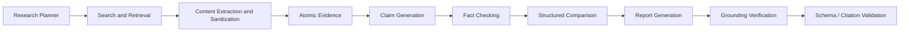

# RivalScope AI — Pipeline Contract

Application-level enforcement around LLM stages. System prompts in `backend/app/services/prompts.py` are narrative contracts; this document describes **code-enforced** gates.

## Stage flow

Implemented LangGraph path:

`normalize_input` → `create_research_plan` → four parallel tracks → `fact_checker_stub` → `comparison_agent` → `report_generator` → END.

| Contract stage | Graph / service | Notes |
|---|---|---|
| Research Planner | `nodes.create_research_plan` | App-owned 8-task plan; `validate_research_plan` |
| Search and Retrieval | `research_tracks` + Tavily | Parallel per company/track |
| Content sanitization | `content_sanitize` + `evidence.py` | Untrusted webpage text |
| Atomic evidence | `EvidenceItem` via `evidence.py` | App-generated IDs |
| Claim generation | Extractive claims in evidence + FC input batch | Claim IDs = evidence IDs |
| Fact checking | `fact_checker.py` | 1:1 normalize + allowlists |
| Comparison | `comparison_agent.py` | Matrix validate + repair |
| Report | `report_generator.py` | Narrative LLM; sources/evidence app-owned |
| Grounding | `grounding_verifier.py` | Post-report deterministic |
| Confidence | `confidence.py` | Deterministic 0–100 |

---

## Models (repository names)

### ResearchTask / plan

- Fields: `id`, `track`, `objective` (query text), `priority`
- Tracks: `company_profile` | `product_features` | `pricing` | `recent_news`
- Validation (`validate_research_plan`, strict): 7–9 tasks; company_profile 1–2; product_features 2–3; pricing 1–2; recent_news exactly 2; no duplicate normalized objectives; no unknown tracks; no empty objectives

### Source (`Source`)

App-generated `id` (UUID in real mode). Fields include `title`, `url`, `sourceType`, `publishedDate?`, `credibilityScore`, `retrieved_at`, `snippet`, `company`.

### Atomic evidence (`EvidenceItem`)

One principal factual proposition per item: `id`, `claim`, `sourceId`, `confidence`, `evidence_type`, `url`, `raw_text` (sanitized), `company`.

### Claim / checked claim (`VerifiedClaim`)

- Input claims = evidence batch (stable `id` + `claim` text)
- Output: `verificationStatus` ∈ `verified` | `weakly_supported` | `unsupported` (+ `mock_verified` in demo)
- `normalize_fact_checker_results` enforces 1:1 order/text; scrubs unknown source IDs

### ComparisonMatrix

Frontend-compatible: `rows[]` with `dimension`, `ourValue`, `competitorValue`, `ourSourceIds`, `competitorSourceIds`, `advantage`; plus `pricingComparison`, `positioningGap`, `summary`.

### CompetitorReport

Frontend-compatible camelCase aliases. Canonical `sources` / `evidence` attached by application code, not invented by the LLM.

---

## Source ownership allowlists

Built by `build_source_allowlists(sources, our_company, competitor)`:

- `all_ids`, `our_ids`, `competitor_ids`, `untagged_ids`

Used before/after fact check, comparison, and report attachment. Unknown IDs dropped; cross-company IDs removed from the wrong side’s arrays.

---

## Claim policy

| Status | Decisive narrative (strengths, advantages, battlecard) | Report context |
|---|---|---|
| `verified` / `mock_verified` | Allowed | Allowed |
| `weakly_supported` | Not for decisive advantages | Allowed with status tag |
| `unsupported` | Blocked in code | Excluded from report LLM context |

---

## Comparison rules (code)

- Distinct dimensions; invalid `advantage` → `unclear`
- Missing / “Not found…” side or empty source IDs → cannot be `our` / `competitor` / `parity`
- OUR IDs only in `ourSourceIds`; competitor IDs only in `competitorSourceIds`
- Pricing dimension with incompatible currency or month/year basis → `unclear`
- Structured repair: one LLM repair on unusable JSON/no rows; then deterministic fallback matrix

---

## Report + grounding

1. Filter unsupported claims from context  
2. LLM fills narrative fields only  
3. Attach state `sources` / `evidence`  
4. `verify_report_grounding` + `apply_grounding_repairs` (strip ungrounded/contradicted list items; soften bad strings to “Not found in available sources.”)  
5. Replace `confidenceScore` with `compute_confidence_score`

### Confidence formula (0–100)

Weighted sum (weights sum to 1.0):

- 20% section fill ratio  
- 25% verified-claim ratio  
- 15% mean source credibility  
- 15% primary-source share (`company_page` / `pricing_page` / `docs`)  
- 15% comparison cell fill  
- 10% × (1 − penalty) where penalty increases with unsupported/weak share, missing pricing source, untagged companies  

If fewer than 3 evidence items, score × 0.85. Clamped to [0, 100].

---

## LLM execution policy (`llm.py`)

| Stage | Temperature |
|---|---|
| research_planner / evidence / claims / fact_checker / grounding_verifier | 0.0 |
| comparison_agent / report_generator | 0.1 |

- Primary: Groq (configurable); Gemini fallback when configured  
- Per-step overrides: `FACT_CHECKER_PROVIDER`, `COMPARISON_PROVIDER`, `REPORT_PROVIDER`  
- Timeout: `LLM_REQUEST_TIMEOUT_SECONDS` (default 60)  
- Same-provider retries: `LLM_MAX_RETRIES` (default 2) with exponential backoff for rate-limit / provider errors  
- No fallback on auth/config errors  
- Oversized Groq payloads may skip to Gemini when Gemini is available  
- Logs: stage, provider, attempt, latency, validation outcomes — never API keys or full documents  

---

## Sanitization

`sanitize_retrieved_text`: strip script/style/tags; flag injection-like phrases; wrap suspicious content in UNTRUSTED boundaries; truncate. Detection reduces trust; it does not guarantee safety.

---

## Failure behavior

| Failure | Behavior |
|---|---|
| Track search error | Warning + empty contribution; pipeline continues |
| Fact-check LLM fail | Soft `weakly_supported` / mock path |
| Comparison parse/validate fail after repair | Deterministic fallback matrix |
| Report LLM fail | Evidence-only fallback report |
| Retry exhaustion | Controlled `RuntimeError` after both providers fail |

---

## Intentionally deferred

- Full LLM research planner (prompt reserved; plan is app-owned)  
- Separate typed pricing/feature metadata schema beyond `EvidenceItem`  
- LLM semantic grounding verifier (deterministic token/price checks only)  
- Changing public API field names  
